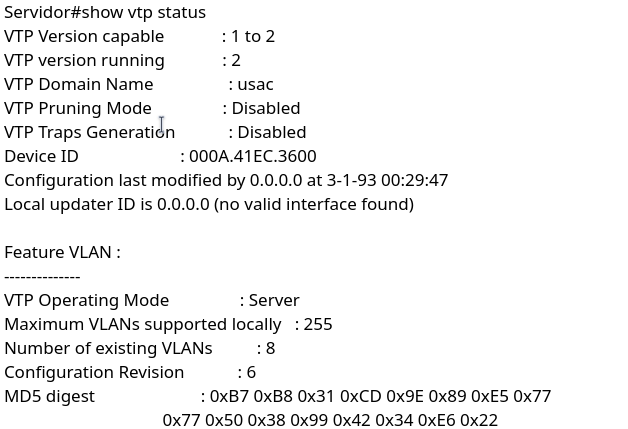
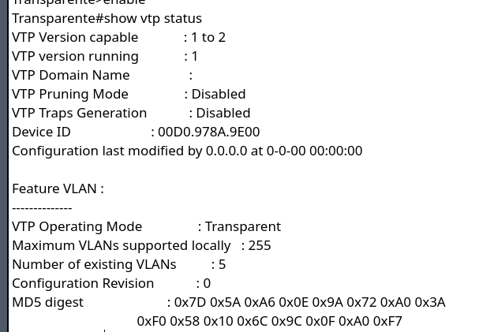
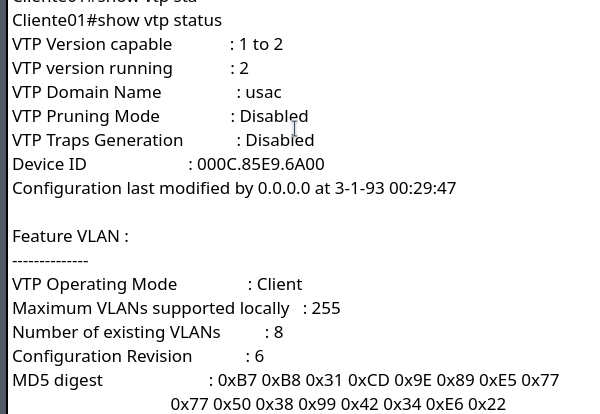
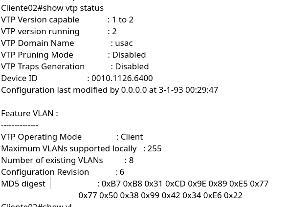
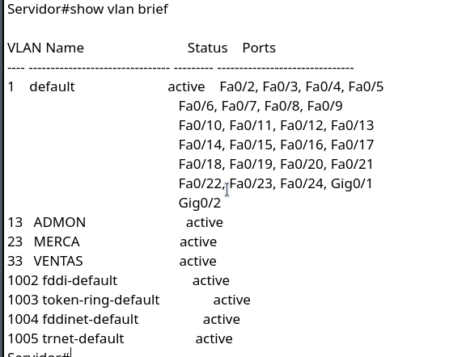
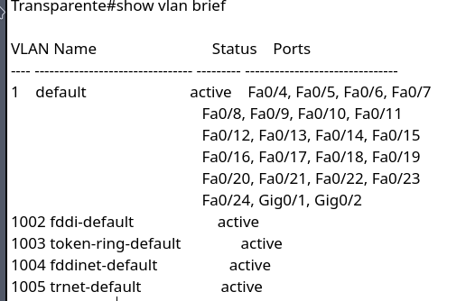
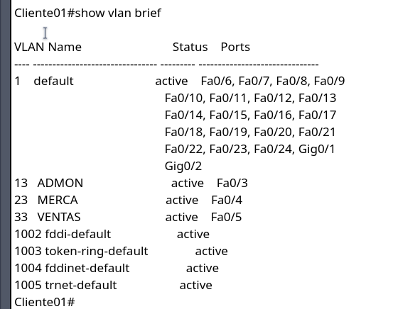
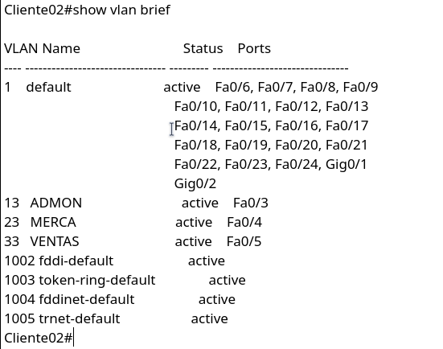
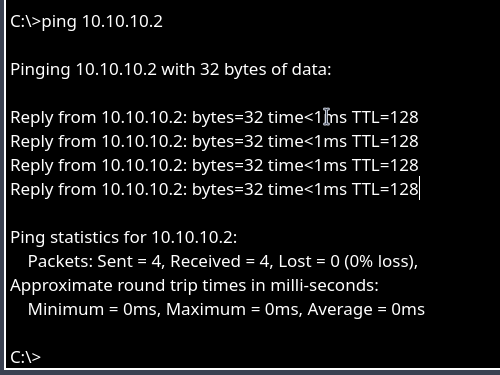
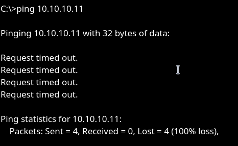

# Manual de Configuración de VLANs y VTP

## Introducción
Este documento detalla la configuración de una topología de red con VLANs y el protocolo VTP en Cisco Packet Tracer. Se utilizan cuatro switches (servidor, transparente, cliente01, cliente02) y seis PCs, asignadas a VLANs específicas.

## Configuración de Switches

### Switch Servidor (VTP Server)
```bash
enable
configure terminal
hostname servidor
vtp version 2
vtp domain usac
vtp password 201800673
vtp mode server
vlan 13
 name ADMON
vlan 23
 name MERCA
vlan 33
 name VENTAS
exit
```
### Switch Transparente (VTP Transparent)
```bash
enable
configure terminal
hostname transparente
vtp mode transparent
exit
```

### Switch Cliente01 (VTP Client)

```
enable
configure terminal
hostname cliente01
vtp version 2
vtp domain usac
vtp password 201800673
vtp mode client
exit
```

### Switch Cliente02 (VTP Client)

```
enable
configure terminal
hostname cliente02
vtp version 2
vtp domain usac
vtp password 201800673
vtp mode client
exit
```

## Configuración de Enlaces Trunk
### Configura los puertos entre switches como trunk:
```
interface [interfaz]
    switchport mode trunk
end
```

## Asignación de VLANs a Puertos
### En Cliente01 y Cliente02:
```
interface [interfaz-PC]
    switchport mode access
    switchport access vlan [ID_VLAN]
end
```

## Configuración de PCs
10.10.10.1 y 10.10.10.2 -> VLAN 13
10.10.10.11 y 10.10.10.12 -> VLAN 23
10.10.10.21 y 10.10.10.22 -> VLAN 33

## Verificaciones

### Show VTP Status
#### Switch Servidor:

#### Switch Transparente:

#### Switch Cliente01:

#### Switch Cliente02:


### Show VLAN Brief
#### Switch Servidor:

#### Switch Transparente:

#### Switch Cliente01:

#### Switch Cliente02:


## Pruebas de Conectividad
### Ping entre PCs en la misma VLAN (éxito):

### Ping entre PCs en VLANs diferentes (fallido):

